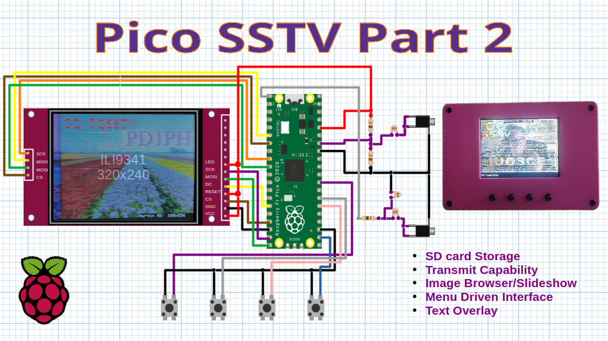

Slow Scan Television Decoder for Raspberry Pi Pico
==================================================

Features
--------

+ Cheap, Easy Build
+ Minimal External Components
+ Martin, Scottie and PD modes
+ Works with any SSB reciever using headphone connector
+ Standalone Design (no PC or soundcard needed)

Getting the Code
----------------

.. code::
  git clone https://github.com/dawsonjon/PicoSSTV.git

Documentation
-------------

For technical details refer to the `technical documentation <https://101-things.readthedocs.io/en/latest/sstv_decoder.html>`__.

3D-Printed Enclosure
--------------------

A 3D printed enclosuer can be found `here <https://github.com/dawsonjon/PicoSSTV.git>`__, including stl files and FreeCAD design files.

Install Arduino Pico
--------------------

The SSTV code is written in pure C++, but a demo application is provided as an `Arduino sketch <https://github.com/dawsonjon/PicoSSTV/tree/main/sstv_decoder>`__. The `Arduino Pico Port <https://github.com/earlephilhower/arduino-pico>` by Earle Philhower is probably the easiest way to install and configure a C++ development environment for the Raspberry Pi Pico. Its possible to install the tool and get up-and running with example applications in just a few minutes. Refer to the `installation instructions <https://github.com/earlephilhower/arduino-pico?tab=readme-ov-file#installing-via-arduino-boards-manager>`__ and the `online documentation <https://arduino-pico.readthedocs.io/en/latest/>`__ to get started.

Credits
-------

This project uses the ILI934X display driver by Darren Horrocks.

