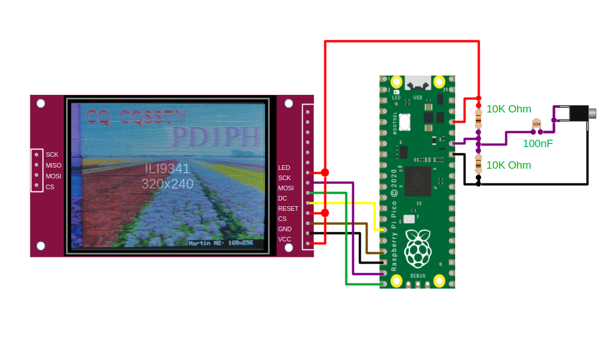
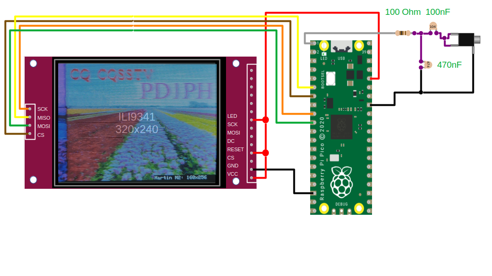

Slow Scan Television for Raspberry Pi Pico
==========================================

.. image::  images/sstv_decoder.jpg

Features
--------

+ Cheap, Easy Build
+ Minimal External Components
+ Transmit and receive functionality
+ Martin, Scottie, Robot, SC2, and PD modes
+ Works with any SSB receiver using a headphone connector
+ Standalone Design (no PC or soundcard needed)
+ SD Card Storage
+ Waterfall
+ Image File Browser and Slideshow

Install Arduino Pico
--------------------

The SSTV code is written in pure C++, but a demo application is provided as an `Arduino library <https://github.com/dawsonjon/PicoSSTV/raw/refs/heads/main/sstv_library.zip>`__. The `Arduino Pico <https://github.com/earlephilhower/arduino-pico>`__ port by Earle Philhower is probably the easiest way to install and configure a C++ development environment for the Raspberry Pi Pico. It is possible to install the tool and get up and running with example applications in just a few minutes. Refer to the `installation instructions <https://github.com/earlephilhower/arduino-pico?tab=readme-ov-file#installing-via-arduino-boards-manager>`__ and the `online documentation <https://arduino-pico.readthedocs.io/en/latest/>`__ to get started.

Install the SSTV library in Arduino Pico
----------------------------------------

The original SSTV decoder used a very simple circuit, and the code was supplied
as a simple sketch. I wanted to include a number of new features that would
require different (additional) hardware. I wanted to provide software to
support existing hardware while also supporting new hardware with a more
comprehensive set of features. I decided that the best approach was to move from an Arduino sketch to
providing an Arduino library. 

1. Install `Arduino IDE <https://support.arduino.cc/hc/en-us/articles/360019833020-Download-and-install-Arduino-IDE#installation-instructions>`__.
2. Install Arduino Pico Core `installation instructions <https://github.com/earlephilhower/arduino-pico?tab=readme-ov-file#installing-via-arduino-boards-manager>`__.
3. Download the `Arduino SSTV library <https://github.com/dawsonjon/PicoSSTV/raw/refs/heads/main/sstv_library.zip>`__.
4. Install the library in the Arduino IDE.

  .. image:: images/library_install.png

5. Load the SSTV examples.

  .. image:: images/arduino_examples.png

Examples
--------

One of the nice things about Arduino libraries
is the ability to include a number of code examples. I chose to use this
feature to provide a few different example designs, ranging from the very simple
to the more complete.

sstv_receive_tft 
''''''''''''''''

Similar to the original design, supporting the original hardware but with new modes.

sstv_receive_with_sd 
''''''''''''''''''''

Adds simple automatic SD card logging to the basic design

.. image:: images/sd_card_circuit.png

sstv_transmit_sd_basic 
''''''''''''''''''''''

A minimal transmit-only example. Transmits an image from SD card.

sstv_full
'''''''''

Receive and transmit functionality, SD card storage and full menu driven UI.

.. image:: images/full_circuit.png
  

Documentation
-------------

For technical details, refer to the technical documentation `part 1 <https://101-things.readthedocs.io/en/latest/sstv_decoder.html>`_ and `part 2 <https://101-things.readthedocs.io/en/latest/sstv_decoder_part2.html>`__.

3D-Printed Enclosure
--------------------

A 3D printed enclosure can be found `here <https://github.com/dawsonjon/PicoSSTV.git>`__, including stl files and FreeCAD design files.

Other Builds
------------

.. image:: https://github.com/Brabudu/WioTerminalSSTV/raw/main/img/sstv.jpg

Check out the `port <https://github.com/Brabudu/WioTerminalSSTV>`__ to Wio Terminal by Franciscu Capuzzi "Brabudu" IS0JSV.

Credits
-------

Many thanks to Franciscu Capuzzi IS0JSV for implementing additional modes and the waterfall feature.
This project uses the ILI934X display driver by Darren Horrocks.

